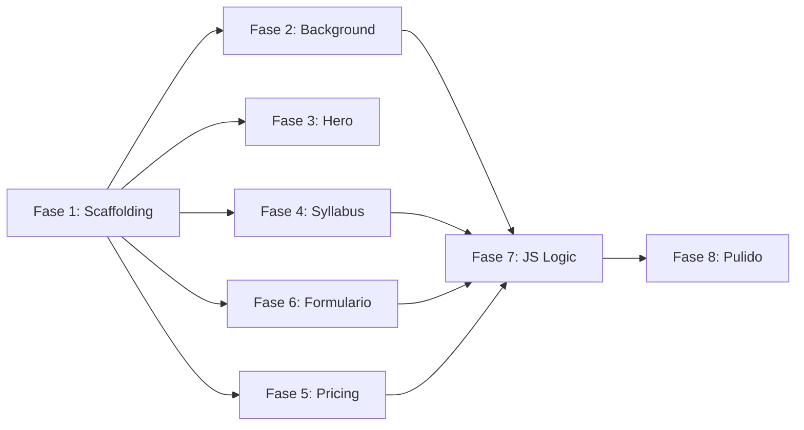

# Plan de Implementación — Zero-Server Geo-App Landing Page

> Documento de referencia para todos los agentes de IA involucrados en el desarrollo.  
> **Fuente:** [plan.md](file:///c:/Users/Tokyotech/sideprojects/spatial_ia_code/plan.md)  
> **Archivo de salida:** `index.html` (SPA single-file)

---

## Restricciones Globales

| Restricción | Detalle |
|---|---|
| **Arquitectura** | Single-file SPA (`index.html`). Zero-build step. |
| **CSS** | Tailwind CSS vía CDN + `<style>` custom para grid/spotlight. |
| **JS** | Vanilla ES6+ en ``.
- `[ ]` Configurar Tailwind inline (`tailwind.config`) con la paleta de colores custom:
  - Background: `#09090b` (Zinc-950)
  - Primary Accent: `#06b6d4` (Cyan-500)
  - Secondary Accent: `#10b981` (Emerald-500)
  - Text heading: `#f8fafc` (Slate-50)
  - Text body: `#94a3b8` (Slate-400)
- `[ ]` Definir en `<style>` las utilidades custom de glassmorphism reutilizables.
- `[ ]` Establecer tipografía: sans-serif para body, `font-mono` para datos técnicos.
- `[ ]` Definir la estructura semántica vacía de secciones: `<header>`, `<main>` (con `<section>` para cada componente), `<footer>`.

### Criterio de aceptación
- El archivo abre en el navegador sin errores de consola.
- El fondo es `#09090b` y Tailwind está operativo (verificable aplicando una clase de color a un elemento de prueba).

---

## Fase 2 — Background Interactivo (Grid + Spotlight)

> 🤖 **Modelo:** `Kimi K2.5` · **Modo:** OpenCode Go

**Objetivo:** Implementar el fondo visual con patrón de grid estático CSS y el gradiente radial dinámico que sigue el mouse.

### Tareas

- `[ ]` Crear el overlay de grid CSS estático usando `<style>` custom (patrón con `background-image: linear-gradient(...)` o similar).
- `[ ]` Definir las CSS custom properties `--x` y `--y` en `:root` con valores iniciales.
- `[ ]` Crear el efecto spotlight con `radial-gradient()` posicionado en `var(--x), var(--y)`.
- `[ ]` Implementar el listener JS `mousemove` en `window` que actualiza `--x` y `--y` con las coordenadas del cursor.

### Criterio de aceptación
- Grid visible sobre el fondo oscuro.
- Spotlight sigue el cursor del mouse de forma fluida.

---

## Fase 3 — Hero Section

> 🤖 **Modelo:** `Qwen3.5 Plus` · **Modo:** OpenCode Go

**Objetivo:** Construir la sección hero con badge de estado, título principal, subtítulo y botones CTA.

### Tareas

- `[ ]` Crear el status badge: `[STATUS: INSCRIPCIONES ABIERTAS]` con `font-mono` y efecto de glow (animación CSS pulse o shadow).
- `[ ]` Implementar el `<h1>`: "CREA APPS WEB DE MAPAS CON IA" con texto gradiente Cyan→Emerald (`bg-gradient-to-r from-cyan-400 to-emerald-400 bg-clip-text text-transparent`).
- `[ ]` Agregar el subtítulo descriptivo con color `Slate-400`.
- `[ ]` Crear CTA primario con efecto neon Cyan: `shadow-[0_0_15px_rgba(6,182,212,0.5)]` + hover intensificado.
- `[ ]` Crear CTA secundario con borde glassmorphism (`border border-white/10`).

### Criterio de aceptación
- Badge con animación glow visible.
- `<h1>` muestra gradiente Cyan→Emerald.
- Botones con efectos hover funcionales.

---

## Fase 4 — Syllabus Interactive Timeline + Terminal

> 🤖 **Modelo:** `MiMo V2.5 Pro` · **Modo:** OpenCode Go

**Objetivo:** Construir las 3 cards descriptivas de sesiones y la terminal lateral interactiva.

### Tareas

- `[ ]` Crear layout responsive: cards a un lado, terminal (`<aside>`) al otro (grid o flex).
- `[ ]` Implementar 3 cards con glassmorphism (`bg-white/5 backdrop-blur-lg border border-white/10 shadow-2xl`):
  - **Sesión 1: Geo-Prompting y Diseño de la Interfaz Web Reactiva**
    - Ecosistema Web SIG sin Servidores.
    - Ingeniería de Prompts para Aplicaciones de Mapas.
    - El Primer Dashboard Territorial Reactivo.
  - **Sesión 2: Geoprocesamiento en Tiempo Real de Servidor a Cliente**
    - Estructuración de Skills de Análisis Web.
    - Cálculos Espaciales On-the-Fly.
    - Gestión de Errores en Aplicaciones Web.
  - **Sesión 3: Integración de Widgets, Dashboard y Despliegue en la Nube**
    - UI/UX Cartográfico con Gráficos Dinámicos.
    - Despliegue de la Aplicación en Producción.
    - Pruebas de Carga y Optimización Final.
- `[ ]` Crear el bloque Terminal Window con estética de consola (`font-mono`, fondo más oscuro, borde superior con dots rojo/amarillo/verde).
- `[ ]` Estado default del terminal: `> SYSTEM IDLE. WAITING FOR INPUT...`
- `[ ]` Implementar listeners JS `mouseenter`/`mouseleave` en cada card para actualizar `innerHTML` del terminal:
  - Hover Session 1: `> LOADING SKILLS... GEO-PROMPTING INITIATED...`
  - Hover Session 2: `> EXECUTING ON-THE-FLY SPATIAL JOINS...`
  - Hover Session 3: `> DEPLOYING DASHBOARD TO GITHUB PAGES... SUCCESS.`
- `[ ]` Al salir del hover, restaurar al estado default.

### Criterio de aceptación
- Hover en cada card cambia el contenido del terminal.
- Al dejar de hacer hover, el terminal regresa al estado idle.
- Layout responsive: stacked en móvil, side-by-side en desktop.

---

## Fase 5 — Pricing Section

> 🤖 **Modelo:** `MiniMax M2.7` · **Modo:** OpenCode Go

**Objetivo:** Crear la sección de precios con dos cards y contador dinámico de escasez.

### Tareas

- `[ ]` Crear 2 cards glassmorphism side-by-side:
  - **Acceso General:** $35.000 CLP. Incluye: Acceso completo a las 3 sesiones del bootcamp, material de apoyo, acceso a grabaciones, y certificado de participación.
  - **Pase Estudiantes:** $30.000 CLP. Incluye: Mismos beneficios que el Acceso General (requiere credencial universitaria o comprobante de matrícula).
- `[ ]` Inyectar el contador de escasez vía JS: `[SYSTEM ALERT: ONLY 7 SEATS REMAINING]` con estilo `font-mono`, color de alerta (Cyan o Amber).
- `[ ]` Aplicar hover effects a las cards de pricing.

### Criterio de aceptación
- Ambas cards visibles con precios.
- Contador de escasez visible y estilizado como alerta del sistema.

---

## Fase 6 — Formulario de Contacto (Web3Forms)

> 🤖 **Modelo:** `GLM-5` · **Modo:** OpenCode Go

**Objetivo:** Implementar el formulario semántico con envío asíncrono a Web3Forms.

### Tareas

- `[ ]` Crear `<form>` semántico con:
  - Campo **Name** (`<input type="text" name="name" required>`).
  - Campo **Email** (`<input type="email" name="email" required>`).
  - Campo **Message** (`<textarea name="message" required>`).
- `[ ]` Incluir campo hidden de access key: `<input type="hidden" name="access_key" value="YOUR_ACCESS_KEY_HERE">`. *(Nota: Mantener este placeholder en el código)*.
- `[ ]` **Documentación Web3Forms:** El agente encargado de esta fase debe generar en su output un bloque de texto con instrucciones paso a paso para el usuario sobre:
  1. Cómo obtener la API Key en Web3Forms.
  2. Cómo configurar una respuesta automática (autoresponder) en Web3Forms para enviar el correo con los datos de pago y fechas del taller a cada persona que se registre.
- `[ ]` Incluir honeypot anti-bot: `<input type="checkbox" name="botcheck" class="hidden">`.
- `[ ]` Estilizar inputs con glassmorphism y focus states (borde Cyan al enfocar).
- `[ ]` Crear botón submit con estilo neon consistente con el CTA primario del hero.

### Criterio de aceptación
- Formulario renderiza correctamente con todos los campos.
- Campos hidden presentes en el DOM pero invisibles.
- Validación HTML5 nativa funcional (required).

---

## Fase 7 — JavaScript Logic Completo

> 🤖 **Modelo:** `MiMo V2.5 Pro` · **Modo:** OpenCode Go

**Objetivo:** Integrar toda la lógica JS en un bloque `<script>` cohesivo al final del `<body>`.

### Tareas

- `[ ]` **Mouse tracking:** Listener `mousemove` → actualiza `--x`, `--y` (si no fue integrado en Fase 2).
- `[ ]` **Terminal state:** Listeners `mouseenter`/`mouseleave` en syllabus cards (si no fue integrado en Fase 4).
- `[ ]` **Form submission:**
  - `event.preventDefault()`.
  - Cambiar texto del botón a `[PROCESANDO...]` y `disabled = true`.
  - `fetch()` POST a `https://api.web3forms.com/submit` con `FormData`.
  - On `200 OK`: Reemplazar el nodo `<form>` con mensaje de éxito en verde monospace: `>> SOLICITUD RECIBIDA. REVISA TU BANDEJA DE ENTRADA.`
  - On error: Mostrar mensaje de error en rojo estilo consola.
- `[ ]` **Scarcity counter:** Inyección JS del alert de asientos restantes (si no fue integrado en Fase 5).

### Criterio de aceptación
- Mouse spotlight funcional.
- Terminal interactivo funcional.
- Formulario envía, muestra estado de carga, y maneja éxito/error.
- Zero errores en consola del navegador.

---

## Fase 8 — Pulido Final y Verificación (QA/QC)

> 🤖 **Modelo:** `Gemini 3.5` · **Modo:** Revisión QA/QC

**Objetivo:** Revisión integral, optimización y validación final.

### Tareas

- `[ ]` Verificar responsive design en viewports: 320px, 768px, 1024px, 1440px.
- `[ ]` Revisar accesibilidad básica: `alt` en imágenes (si aplica), contraste de texto, `aria-labels` en elementos interactivos.
- `[ ]` Validar que no hay errores ni warnings en la consola del navegador.
- `[ ]` Confirmar que el archivo es completamente autónomo (zero dependencies externas salvo Tailwind CDN).
- `[ ]` Revisar SEO: `<title>`, `<meta description>`, heading hierarchy (`<h1>` único).
- `[ ]` Verificar que el glassmorphism se aplica consistentemente en todas las cards/panels.
- `[ ]` Test manual del flujo completo: scroll → hover syllabus → pricing → envío de formulario.

### Criterio de aceptación
- Diseño cohesivo cyberpunk/retro-tech en todos los breakpoints.
- Zero errores de consola.
- Formulario funcional end-to-end (requiere access key real para test completo).

---

## Dependencias entre Fases

> **Nota:** Las Fases 2–6 dependen de Fase 1 pero son independientes entre sí y pueden desarrollarse en paralelo. Fase 7 consolida la lógica JS de todas las anteriores. Fase 8 es la validación final.

---
