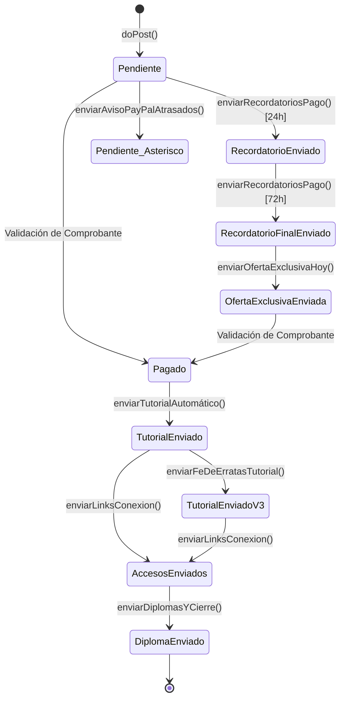

# Spec: CRM Automation & Transaccional (`crm-automation`)

## 1. Propósito y Alcance
Especifica el motor de backend serverless implementado en Google Apps Script (`crm_script.gs`) para la recepción de inscripciones, orquestación de pagos, máquina de estados transaccional y comunicación vía correo electrónico.

---

## 2. Reglas de Negocio y Requisitos Técnicos

### `RULE-CRM-001`: Ingesta de Formularios vía Webhook (`doPost`)
- El script expone un endpoint HTTP POST que recibe: `name`, `email`, `country`, `nivel_sig`, `ocupacion`, `plan`.
- Si la hoja de cálculo destino está vacía, se inicializa automáticamente la cabecera: `["Fecha", "Nombre", "Email", "País", "Nivel SIG", "Profesión", "Plan", "Estado Pago"]`.
- Toda nueva inscripción se registra inicialmente en estado `"Pendiente"`.

### `RULE-CRM-002`: Bifurcación Geográfica y por Plan de Pasarelas de Pago
- **Residentes en Chile (`country === "chile"`):**
  - **Plan Acceso General ($30.000 CLP):** Enlace de cobro MercadoPago (`https://www.mercadopago.cl/payment-link/v1/go?link-id=f7b0764f-2801-4b26-a858-59c416eebe42`).
  - **Plan Pase Estudiantes ($25.000 CLP):** Enlace de cobro con descuento MercadoPago (`https://mpago.la/1EvJQi3`).
  - **Opción 2 (Transferencia Bancaria):** Transferencia directa a Banco Falabella, Cta. Corriente `019823326523`, RUT `18.223.053-7`, especificando el monto según plan ($25.000 o $30.000 CLP).
- **Residentes Internacionales (`country !== "chile"`):**
  - **Plan Acceso General (35 USD):** Enlace directo de cobro global vía PayPal (`https://www.paypal.com/ncp/payment/2PVCP7EQT3DWU`) por 35 USD.
  - **Plan Pase Estudiantes (29 USD):** Enlace directo de cobro global vía PayPal (`https://www.paypal.com/ncp/payment/2PVCP7EQT3DWU`) por **29 USD** con comprobante de alumno regular.
  - **Opción Alternativa:** Pago en moneda chilena vía MercadoPago adaptado por plan ($25.000 CLP Estudiante / $30.000 CLP General).

### `RULE-CRM-003`: Máquina de Estados Transaccional
La columna 8 (`Estado Pago`) gobierna el ciclo de vida del alumno:

### `RULE-CRM-004`: Despacho de Sockets y Enlaces de Sesión (`enviarLinksConexion`)
- **Filtro estricto:** Solo filas cuyo estado sea `"Tutorial Enviado"` o `"Tutorial Enviado V4"`.
- **Contenido del correo:**
  - Sesión 1 (Viernes 11-SEP): `https://meet.google.com/dkp-rpqg-ktc`
  - Sesión 2 (Sábado 12-SEP): `https://meet.google.com/pgc-rmvk-dgj`
  - Sesión 3 (Domingo 13-SEP): `https://meet.google.com/dos-fcdq-kee`
  - Bóveda permanente en Drive: `https://drive.google.com/drive/folders/1vRA1fkfG01kLL3DfMeVres5re51YqlTg?usp=sharing`
- **Transición de estado:** Actualiza a `"Accesos Enviados"`.

### `RULE-CRM-005`: Notificación Inmediata al Administrador
- En cada ejecución exitosa de `doPost`, se despacha un correo de alerta a `jorge.ulloa.roa@gmail.com` con los datos del postulante para verificación inmediata.

### `RULE-CRM-006`: Oferta Exclusiva Posterior al Recordatorio Final
- `enviarOfertaExclusivaHoy()` se ejecuta manualmente y procesa únicamente filas con estado exacto `"Recordatorio Final Enviado"` y correo válido.
- **Chile:** oferta de **$20.000 CLP** mediante MercadoPago (`https://mpago.la/1E75xtF`).
- **Internacional:** oferta de **22 USD** mediante PayPal (`https://www.paypal.com/ncp/payment/RGT8AG7R7U4DA`).
- La vigencia termina a las 23:59 del día de envío, según horario de Chile (`America/Santiago`).
- Un envío exitoso cambia el estado a `"Oferta Exclusiva Enviada"`, impidiendo duplicados.
- Si falta el enlace correspondiente al país, el correo no se envía y el estado permanece intacto.

### `RULE-CRM-007`: Cupón Promocional CONMAPAS en Formulario Web y CRM
- El formulario de registro en [index.html](file:///c:/Users/Tokyotech/sideprojects/spatial_ia_code/index.html) expone el campo opcional `cupon`.
- Validación interactiva en tiempo real en frontend: si el valor ingresado es `CONMAPAS` (case-insensitive), se despliega de inmediato un badge visual indicando la tarifa con descuento ($20.000 CLP en Chile o 22 USD internacionalmente).
- Ingesta en `doPost(e)`:
  - Detecta si `cupon.toUpperCase().trim() === "CONMAPAS"`.
  - Asigna tarifa de **$20.000 CLP** con enlace MercadoPago `https://mpago.la/1E75xtF` y datos de transferencia bancaria por $20.000 CLP para Chile.
  - Asigna tarifa de **22 USD** con enlace PayPal `https://www.paypal.com/ncp/payment/RGT8AG7R7U4DA` y alternativa MercadoPago para postulantes extranjeros.
  - En la hoja de cálculo, el cupón se concatena en la columna `Plan` como `[Plan] [Cupón CONMAPAS: $20.000 CLP / 22 USD]` para preservar la posición de la columna 8 (`Estado Pago`) sin romper ningún trigger.
  - Se notifica al administrador en `[SYS.NOTIFY]` la aplicación del cupón.
- En `enviarRecordatoriosPago()`:
  - Se valida si el registro contiene el cupón para despachar recordatorios periódicos (24h y 72h) respetando la tarifa reducida ($20.000 CLP / 22 USD).

---

## 3. Implementación y Mapeo en Código

| Función | Archivo | Líneas Aprox. | Propósito |
| :--- | :--- | :--- | :--- |
| `doPost(e)` | [crm_script.gs](file:///c:/Users/Tokyotech/sideprojects/spatial_ia_code/crm_script.gs#L33-L150) | 33–150 | Receptor de inscripciones, parsing de cupón `CONMAPAS` y despacho de bienvenida |
| `enviarRecordatoriosPago()` | [crm_script.gs](file:///c:/Users/Tokyotech/sideprojects/spatial_ia_code/crm_script.gs#L155-L235) | 155–235 | Cron de 24h y 72h respetando precios regulares o promocionales con cupón |
| `enviarOfertaExclusivaHoy()` | [crm_script.gs](file:///c:/Users/Tokyotech/sideprojects/spatial_ia_code/crm_script.gs#L240-L300) | 240–300 | Oferta manual de un día para postulantes con recordatorio final agotado |
| `enviarTutorialAutomático()` | [crm_script.gs](file:///c:/Users/Tokyotech/sideprojects/spatial_ia_code/crm_script.gs#L305-L355) | 305–355 | Entrega de binarios e instructivo de instalación a alumnos con pago confirmado |
| `enviarLinksConexion()` | [crm_script.gs](file:///c:/Users/Tokyotech/sideprojects/spatial_ia_code/crm_script.gs#L415-L490) | 415–490 | Envío masivo de accesos a Google Meet y Drive |
